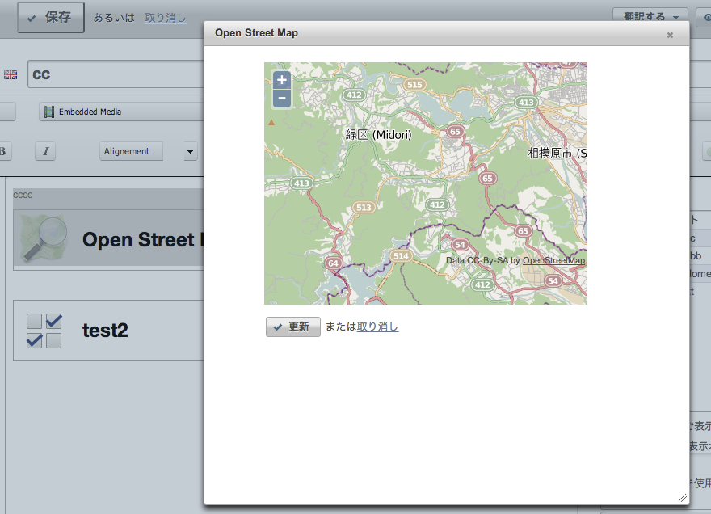

OSM
====

An Novius OS application to create an OSM map (iframe style) and display it.

Many thanks to [Open Street Map](http://www.openstreetmap.org/) and everybody who commits OSM.

**Licence**

Licensed under [GNU Affero General Public License v3](http://www.gnu.org/licenses/agpl-3.0.html) or (at your option) any later version